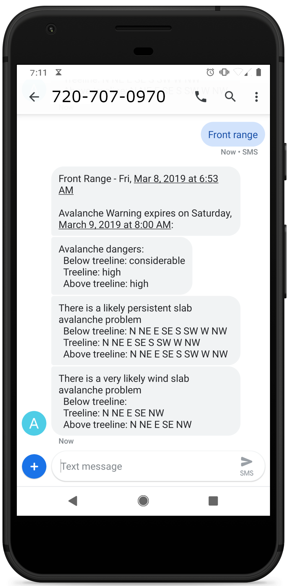
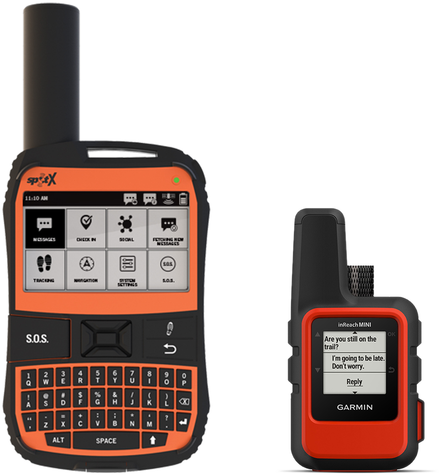

---
# Feel free to add content and custom Front Matter to this file.
# To modify the layout, see https://jekyllrb.com/docs/themes/#overriding-theme-defaults

layout: page
---



## 
Automated text message service for retrieving avalanche forecasts

<table style="border: none">
  <tbody>
    <tr>
      <td style="border: none">
        <h3>Get the Latest Forecast</h3>
        

          Text <strong>720-707-0970</strong> with your Colorado region to receive the
          most up to date avalanche forecast
        

        <h3>Supported Regions</h3>
        

          Steamboat &amp; Flat Tops 
          Front Range 
          Vail &amp; Summit County 
          Sawatch 
          Aspen 
          Gunnison 
          Grand Mesa 
          North San Juan 
          South San Juan 
          Sangre de Cristo 
        

      </td>
      <td style="border: none">
        
      </td>
    </tr>
    <tr style="background-color: transparent">
      <td style="border: none">
        <h3>Use With Satellite Text Messengers</h3>
        

          Retrieve the latest avalanche forecast on your InReach, Spot X, or other
          satellite text messenger
        

      </td>
      <td style="border: none">
        
      </td>
    </tr>
  </tbody>
</table>

<h3>Text 720-707-0970</h3>

  Text your region to this number to receive the avalanche forecast.

 
 

AVYSMS is powered by the information from the <a href="https://avalanche.state.co.us/" target="_black">Colorado Avalanche Information Center</a>. There is no affiliation between AVYSMS and the CAIC.

